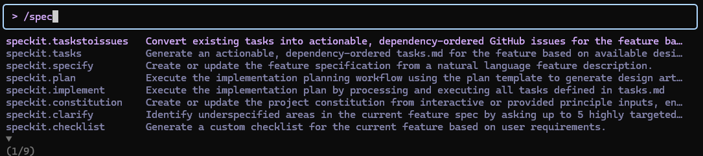

# Spec-Driven Development (SDD) Tutorial Using SpecKit and Gemini

This tutorial guides you step-by-step through setting up and using **Spec-Driven Development (SDD)**. We will use **Specify CLI** (referred to as "speckit") to orchestrate the workflow and **Gemini CLI** for intelligent content and code generation.

## 1. Key Concepts of SDD

SDD structures AI-assisted development into 4 distinct phases, each producing a validated artifact before moving to the next:

1.  **Constitution** (`constitution.md`): The non-negotiable rules. Command: `/speckit.constitution`
2.  **Specify** (`spec.md`): Functional requirements. Command: `/speckit.specify`
3.  **Plan** (`plan.md`): Technical breakdown. Command: `/speckit.plan`
4.  **Task & Execute** (`tasks.md`): Actionable tasks. Command: `/speckit.tasks` then `/speckit.implement`

## 2. Prerequisites and Installation

### Necessary Tools
Ensure you have the following installed in your environment (Linux):

1.  **Python 3.8+** and `uv` (recommended for installing Specify CLI).
2.  **Gemini CLI**: To interact with the AI from the terminal.
3.  **VSCode** or **IntelliJ** with the **Gemini Code Assist** extension.
4.  **Java 21** and **Maven** (for this specific use case).

### Installing Specify CLI
The **Specify CLI** is managed by the [official Spec Kit repository](https://github.com/github/spec-kit) and is best installed using uv, the modern Python package installer.

```bash
# 1. Install 'uv' using pip (assuming pip is already available with Python)
# If pip is not available, you may need to install it first.
pip install uv

# 2. Use 'uv' to install the Specify CLI package
uv tool install specify-cli --from git+https://github.com/github/spec-kit.git

# 3. Verify installation
specify --help
```

## 3. Project Initialization

> [!CAUTION]
> **Git Root Requirement**: You **MUST** be at the root of your Git repository.
> Speckit relies heavily on Git context. Initializing in a subdirectory (e.g., `backend/`) causes LLM errors (wrong paths, loops).

```bash
# Navigate to your project root
cd /path/to/your/project

# Initialize the Spec Kit, binding Gemini as the AI agent. Press y if asked
specify init --here --ai gemini

# Optional check to confirm all tools are installed
specify check
```

**Result**: 

```bash
Checking for installed tools...

Check Available Tools
├── ● Git version control (available)
├── ○ GitHub Copilot (IDE-based, no CLI check)
├── ● Claude Code (available)
├── ● Gemini CLI (available)
├── ○ Cursor (IDE-based, no CLI check)
├── ● Qwen Code (not found)
├── ● opencode (not found)
├── ● Codex CLI (not found)
├── ○ Windsurf (IDE-based, no CLI check)
├── ○ Kilo Code (IDE-based, no CLI check)
├── ● Auggie CLI (not found)
├── ● CodeBuddy (not found)
├── ● Qoder CLI (not found)
├── ○ Roo Code (IDE-based, no CLI check)
├── ● Amazon Q Developer CLI (not found)
├── ● Amp (not found)
├── ● SHAI (not found)
├── ○ IBM Bob (IDE-based, no CLI check)
├── ● Visual Studio Code (available)
└── ● Visual Studio Code Insiders (not found)

Specify CLI is ready to use!
```

This creates the `.specify` and the `.gemini` directories. These directories abstract the complexity of context management and tool integration.

### Understanding the Generated Structure

*   **`.specify/` (The Process)**: The core orchestrator enforcing the **Gated Flow** (Constitution → Spec → Plan → Task).
    *   **`memory`**: Stores current state and validated artifacts (`spec.md`, `plan.md`) to ensure context.
    *   **`templates`**: Markdown blueprints for artifacts, ensuring standard documentation formats.
    *   **`scripts`**: Custom hooks to extend the CLI behavior.

*   **`.gemini/` (The Tool)**: The abstraction layer for the AI agent.
    *   **Configuration**: Stores model preferences (e.g., `gemini-2.5-pro`) and parameters.
    *   **System Prompts**: Specialized instructions passed to Gemini for each SDD phase (e.g., "Act as an Architect").

> **In short**: `.specify` manages the **HOW** (Process), while `.gemini` manages the **WHO** (AI Tool).

Once done, launch `gemini` in your project directory and start typing `speckit` you'll see the list of all speckit commands directly integrated into you gemini cli:



## 4. Concrete Use Case: Simple Task Manager API

We will apply the SDD workflow to develop a **Task Manager API** (Java/Spring Boot) that exposes CRUD endpoints for tasks and persists them in an in-memory database (H2). This ensures the app runs immediately without external middleware.

### Step 1: The Constitution (`.specify/constitution.md`)

This is the foundational step. Edit `.specify/constitution.md` to reflect the strict constraints for your entire project.

#### 1. Use the integrated specify constitution command, within Gemini CLI, to generate the file structure and provide the required context.

```markdown
# Use the integrated command to start the generation of the constitution.md file
/speckit.constitution Create principles for this project. Ask, don't guess
```

**Result**: Gemini should answer something like this, since we did not provide any argument:

*Note: Remember that this is a LLM so answers can be different. It could ask for name and description only and then principles or all at the same time.*

```markdown
✦ I'm ready to create the project constitution. First, what is the name of this project? I also need to know the core
principles you want to establish. Please provide at least one, and I will follow up with any necessary questions.
```
        
#### 2. In any case, provide this answer (using `CTRL-X`):

```markdown
# Project Constitution: Task Manager API
# Ratification Date: today

## Tech Stack
- **Language**: Java 21
- **Framework**: Spring Boot 3.5.8
- **Database**: H2 (In-Memory)
- **Build Tool**: Maven

## Architectural Constraints (Strict)
- **No ORMs**: Strictly forbidden (Hibernate, JPA, etc.). Use **JdbcTemplate** exclusively for database access.
- **Layered Architecture**: Controller -> Service -> Repository.
- **Validation**: Use `jakarta.validation` constraints on DTOs.

## Coding Standards
- **Testing**: JUnit 5 and Mockito. **Minimum 80% code coverage** enforced.
- **Documentation**: Javadoc on all public methods.
- **Style**: Google Java Style Guide.
- **Commits**: Follow **Conventional Commits** (e.g., `feat: add task endpoint`).
```

> [!TIP]
> **Where to put Technical Requirements?**
> *   **Constitution**: Global, non-negotiable rules that apply to **every** feature (e.g., "Always use JdbcTemplate", "Java 21").
> *   **Specify**: Constraints specific to **this** feature only (e.g., "This endpoint must respond in < 50ms", "Use a Redis set for this specific counter").


*Allow actions & Accept modifications from Gemini if asked*

**Results**: 

* After some readings (templates, configurations, etc.), a brand new `constitution.md` file should have been generated. See [constitution.md](./.specify/memory/constitution.md)

```markdown
✦ All templates have been successfully updated to align with the new constitution.

Here is a summary of the actions taken:
- Created Constitution: Drafted and wrote v1.0.0 of the project constitution to .specify/memory/constitution.md. This
    was a major version bump (from 0.0.0 to 1.0.0) as it establishes the initial set of governing principles.
- Updated Plan Template: Aligned .specify/templates/plan-template.md with the project's specific tech stack and added
    a "Constitution Check" section to enforce the new rules.
- Updated Spec Template: Added a "Constitutional Adherence" section to .specify/templates/spec-template.md to ensure
    feature design respects the project's core principles.
- Updated Tasks Template: Modified .specify/templates/tasks-template.md to use Java/Maven conventions and reflect the
    mandatory testing requirement.

All files are now in sync.
```

> [!NOTE]
> [plan-template.md](./.specify/templates/plan-template.md), [spec-template.md](./.specify/templates/spec-template.md) and [tasks-template.md](./.specify/templates/tasks-template.md) should also have been updated. This will ensure that your core principles will be effectively checked during specify, plan and implementation phases.

#### 3. At this stage you can **review, update and iterate** on the constitution file including all your requirements, context, etc.

> [!WARNING]
> **Syncing Changes**: If you edit `constitution.md` manually, you **must** run `/speckit.constitution` again.
> This ensures that the changes are propagated to the `.specify/templates/` (e.g., updating the Plan template to reflect new architectural rules) and the AI's system prompts.

### Step 2: Specify

We define the feature functionally.

#### 1. Execute this command to create the spec

```bash
/speckit.specify --new "Task CRUD Operations"
```

**Result**: Gemini should answer something like this:

*Note: Remember that this is a LLM so answers can be different.*

```markdown
✦ I am ready for your command. Please describe the feature you would like me to specify.
```
        
#### 2. In any case, provide this answer (using `CTRL-X`):

```markdown
# Feature: Task CRUD Operations

## Context
Users need a simple way to manage their daily tasks (create, list, complete) via a REST API.

## Requirements
1.  **Create Task**:
    - `POST /api/v1/tasks`
    - Payload: `title` (String), `description` (String, optional).
    - Response: `201 Created` with the created Task.
2.  **List Tasks**:
    - `GET /api/v1/tasks`
    - Returns a list of all tasks.
3.  **Complete Task**:
    - `PATCH /api/v1/tasks/{id}/complete`
    - Marks the task as completed.
4.  **Data Model**:
    - `id` (UUID), `title`, `description`, `completed` (boolean), `createdAt` (datetime).

## Non-Goals
- User authentication.
- Complex filtering or pagination (for now).
```

> [!NOTE]
> As required by [SpecKit](https://github.com/github/spec-kit/blob/main/spec-driven.md#the-speckitspecify-command), Gemini will perform some tasks : numbering the feature, creating a branch, copying and customizing the specification template and creating the `specs/[branch-name]/` structure. Depending on your will, it can also manage commit and push for you.

*Allow actions & Accept modifications from Gemini if asked*

**Result**:

```markdown
✦ All steps are complete. I've created the branch and files, written the specification, and passed the validation
  checklist. I'll now report completion, providing the branch name and spec file path, and confirm it's ready for the
  next step.All steps are complete: feature branch and files created, specification written, validation checklist
  passed. I will now report completion, providing the branch name and spec file path, confirming readiness for next
  steps.
```

> [!IMPORTANT]
> **Git Workflow**: This command automatically creates a new feature branch (e.g., `001-task-crud-operations`).
> **Action**: Switch to this branch (`git checkout 001-task-crud-operations`) if not already done automatically. You will stay on this branch for the Plan, Task, and Execute phases.

This created a `spec.md` file. See [spec.md](./specs/001-task-crud-operations/spec.md)

You can also see that a corresponding checklist has been created for your feature to ensure it passes all requirements. See [requirement.md](./specs/001-task-crud-operations/checklists/requirements.md):

```markdown
# Specification Quality Checklist: Task CRUD Operations

**Purpose**: Validate specification completeness and quality before proceeding to planning
**Created**: 2025-12-11
**Feature**: [spec.md](./spec.md)

## Content Quality

- [x] No implementation details (languages, frameworks, APIs)
- [x] Focused on user value and business needs
- [x] Written for non-technical stakeholders
- [x] All mandatory sections completed

## Requirement Completeness

- [x] No [NEEDS CLARIFICATION] markers remain
- [x] Requirements are testable and unambiguous
- [x] Success criteria are measurable
- [x] Success criteria are technology-agnostic (no implementation details)
- [x] All acceptance scenarios are defined
- [x] Edge cases are identified
- [x] Scope is clearly bounded
- [x] Dependencies and assumptions identified

## Feature Readiness

- [x] All functional requirements have clear acceptance criteria
- [x] User scenarios cover primary flows
- [x] Feature meets measurable outcomes defined in Success Criteria
- [x] No implementation details leak into specification

## Notes

- All validation checks passed. The specification is ready for the planning phase.
```

**Validation:** Review `spec.md`. If satisfied, proceed.

> [!WARNING]
> **Manual Edits?** If you manually modify `spec.md` (e.g., removing a requirement), the previous checklist becomes stale.
> **Force Re-evaluation**: Run `/speckit.checklist` to generate a fresh analysis of your current `spec.md` before proceeding.

#### 3. Validate with Quality Gate (optional)

The checklist generated at the end of the `specify` command is your **Quality Gate**. If not satisfied, the workflow should be blocked.

> [!IMPORTANT]
> Sometimes, AI agents are "over-helpful" and might proceed if they find the spec clear enough despite the unchecked box. This is **Soft Enforcement**. In a strict CI/CD pipeline using the CLI directly, this would be a **Hard Error**. See [Step 8. Going Further: CI/CD Integration](#step-8-going-further-ci-cd-integration)

**Demonstration of Workflow Enforcement:**
1.  **Action**: Deliberately **uncheck** one box in the generated checklist.
2.  **Try to Proceed**: Run `/speckit.plan`.
3.  **Result**: The tool **should** block you.
4.  **Fix**: Check all boxes to explicitly "sign off" the Spec.
5.  **Proceed**: Now run `/speckit.plan` again.

### Step 3: Plan

The AI generates a technical plan based on the `constitution.md` and `spec.md`.

#### 1. Refinement (optional)

> [!IMPORTANT]
> A best practice before planning is to ensure ensure your spec is unambiguous.

1.  Run `/speckit.clarify`.
2.  **Action**: The tool will ask questions about ambiguities (e.g., "What is the max length of content?").
3.  **Fix**: Update `spec.md` with the answers.
4.  **Repeat** until `/speckit.clarify` returns "No ambiguities found". This ensures the AI has a solid foundation for the Plan.

**Example**:

```markdown
Question 3: Data Volume / Scale

Context: The specification mentions listing 'all tasks' and handling '50 concurrent users', but doesn't specify an anticipated upper limit for the number
of tasks a single user might have. This information is crucial for optimizing data storage and retrieval performance.

What we need to know: What is the anticipated maximum number of tasks a single user is expected to manage?

Suggested: 1000 tasks - This is a common upper limit for simple personal task management tools, providing a reasonable baseline for initial design
without over-engineering for extreme cases.

Format: Short answer (<=5 words). You can accept the suggestion by saying "yes" or "suggested", or provide your own answer.
```

For each of your choices, the spec will be updated with your answers

**Result**:

```markdown
// specs/001-task-crud-operations/spec.md

...

## Clarifications

### Session 2025-12-11
- Q: What are the expected uptime and data recovery objectives for the Task CRUD API? → A: Uptime: 99.9%, RTO: 4 hours, RPO: 1 hour
- Q: What is the expected behavior when attempting to complete an already completed task? → A: Idempotent success (no-op)
- Q: What is the anticipated maximum number of tasks a single user is expected to manage? → A: 1000 tasks

...

### Non-Functional Requirements

- **NFR-001 (Reliability)**: The service MUST maintain 99.9% uptime.
- **NFR-002 (Recovery)**: The system must be recoverable within 4 hours (RTO), with a maximum data loss of 1 hour (RPO).
- **NFR-003 (Data Volume)**: The system MUST support a maximum of 1000 tasks per user.

...
```

The session should end with a summary:

```markdown
The clarification process has concluded as the maximum of 5 questions has been reached.

Question 5 regarding long-term scalability targets remains unanswered and will be marked as 'Deferred'.
This means the current specification does not contain explicit long-term scalability goals beyond the initial 50
concurrent users. This might be addressed later in the planning phase or by re-running the clarification process.

---                                                                                                                    

**Clarification Session Summary:**

*   **Questions Asked:** 5
*   **Questions Answered:** 4
*   **Path to Updated Spec:** ./specs/001-task-crud-operations/spec.md
*   **Sections Touched:**
    * Clarifications
    *   Non-Functional Requirements
    *   Edge Cases

**Coverage Summary:**

| Category                       | Status                                                                    |
| :----------------------------- | :------------------------------------------------------------------------ |
| Functional Scope & Behavior    | Clear                                                                     |
| Domain & Data Model            | Resolved (Data Volume / Scale)                                            |
| Interaction & UX Flow          | Resolved (Error/empty/loading states)                                     |
| Non-Functional Quality Attributes | Resolved (Reliability & Availability, Observability), Deferred (Scalability, Security & Privacy, Compliance) |
| Integration & External Dependencies | Clear                                                                     |
| Edge Cases & Failure Handling  | Resolved (Negative scenarios), Outstanding (Rate limiting / throttling, Conflict resolution) |
| Constraints & Tradeoffs        | Clear                                                                     |
| Terminology & Consistency      | Clear                                                                     |
| Completion Signals             | Clear                                                                     |
| Misc / Placeholders            | Clear                                                                     |

---                                                                                                                    

**Recommendation:**                                                                                                    

You can now proceed to the planning phase. However, be aware that the specification still has some 'Deferred' and
'Outstanding' areas, notably long-term scalability targets, security & privacy considerations, compliance, rate 
limiting, and conflict resolution. These might need further discussion during planning or a dedicated clarification
session later.

**Suggested Next Command:**

To build the technical plan based on this specification, you can run: 
`/speckit.plan Create a plan for the spec. I am building with...`
```

#### 2. Execute this command to create the plan for this spec

```bash
/speckit.plan Create a plan for the spec.
```

*Note: If automatic AI integration isn't configured in `specify`, copy `spec.md` and `constitution.md` and ask Gemini CLI or GCA: "Generate a detailed implementation plan for this spec, strictly following the constitution."*

**Result**:

The plan command will generate a very detailled plan and technical documentation / specifications for the current spec including, in our case [data-model.md](./specs/001-task-crud-operations/data-model.md), [quickstart.md](./specs/001-task-crud-operations/quickstart.md), [research.md](./specs/001-task-crud-operations/research.md), [openapi.yaml](./specs/001-task-crud-operations/contracts/openapi.yaml).

And the generated [plan.md](./specs/001-task-crud-operations/plan.md) including project structure, structure decisions, etc.

```markdown
The implementation planning for 'Task CRUD Operations' is complete.

**Details:**

*   **Feature Branch:** `001-task-crud-operations`
*   **Implementation Plan (filled):** `./specs/001-task-crud-operations/plan.md`

**Generated Design Artifacts:**

*   **Research Document:** `./specs/001-task-crud-operations/research.md` (no specific research required, as noted in the document)
*   **Data Model Definition:** `./specs/001-task-crud-operations/data-model.md`
*   **API Contract (OpenAPI):** `./specs/001-task-crud-operations/contracts/openapi.yaml`
*   **Quickstart Guide:** `./specs/001-task-crud-operations/quickstart.md`

**Agent Context Update:** Your agent's context (`GEMINI.md`) has been updated with the project's technical details (Java 21, Spring Boot 3.5.8, H2, Maven).

The feature specification has been thoroughly planned and designed.

**Next Suggested Command:**

To break down this plan into actionable tasks, you can run:
`/speckit.tasks Break the plan into tasks`
```

**Validation:** Review `plan.md` and other docs. If satisfied, proceed.